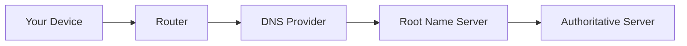

So, you want to learn more about Control D and how it works. You've come to the right place.

# What is Control D?

Control D is a customizable DNS filtering and traffic redirection platform. It can do all the things your standard DNS resolver can (resolve domains to IP addresses), but it can also do a lot more. Think of it as your personal Authoritative DNS resolver for the entire Internet that gives you granular control over what domains get resolved, redirected or blocked.

<Tip>
Control D is a DNS service that you can customize to your needs.
</Tip>

## DNS Primer

When you enter a domain into your browser, it will query the router on your network for the IP address of the website you're trying to load. Your router doesn't perform any DNS resolution and forwards the request upstream to whatever DNS server is configured there. This could be your ISP or a 3rd party resolver like Cloudflare, or Google.

<Tip>
DNS (Domain Name System) is like a phone book for the Internet. It converts human readable names to IP addresses.
</Tip>

Your DNS query will usually takes the following route (simplified view):

The responses that the authoritative DNS server emits are typically static. This means that any user, anywhere, asking any DNS server "where is domain.com" will get the same response. There are some notable exceptions to this when it comes to CDNs, which will geo-code your source IP, and return variable results based on your location. A user in the UK will see different IPs than a user in the US.

# How does Control D work?

Control D is a DNS resolver, and with a default configuration it will work identically to any other DNS resolver. However once you start fiddling with the rules, you can selectively disregard the authoritative DNS records associated with any domain you attempt to resolve (regardless of it actually existing in public DNS), and replace the response with any record that you wish.

<Tip>
Control D provides you with multiple DNS resolvers that can manipulate the responses based on the criteria you have set.
</Tip>

You can prevent a domain from loading, spoof it to an IP of your choice, or to one of over 100 exit proxy locations supported by Control D. In this mode, Control D will transparently proxy SNI (and some non-SNI) enabled traffic through servers in that location/country, masking the client IP.

# Feature Overview

The following will provide a birds eye view of what you can do with Control D. For more in-depth explanations, see the "Web Dashboard" section of this guide.

<Tip>
Block access to categories of sites, individual services/apps, and specific domain names. Block malicious domains. Spoof your IP. View graphs of your browsing activity.
</Tip>

## Web Filtering

Block various categories of websites and services with a single toggle switch. There are 18 Native filters to choose from, as well as over a dozen 3rd party filters. With these, you can block things like:

- Malware and Phishing
- Ads & Trackers
- Potentially harmful content like porn and drug content
- Newly registered domains
- Torrenting and file hosting websites
- Crypto and gambling
- Whole lot more

Filtering can be also scoped to specific services like Facebook, TikTok, or Steam - there are 400+ to choose from.

Lastly, you can have granular control over individual domain names, where you can block specific websites, and even whole TLDs. Wildcard rules are supported.

## Malware Protection

Preventing malicious domains from resolving in real time is one of the best ways to protect your devices and networks from getting owned. Control D has several layers of protection:

- **Domain level threat intelligence feeds** - We subscribe to dozens of threat intel feeds, and block domains in real time as part of the Malware "Relaxed" Filter.
- **IP level threat intelligence feeds** - We subscribe to IP level feeds, and block domains that resolve to malicious IPs as part of the Malware "Strict" Filter.
- **Machine Learning Blocking** - Our in-line ML model blocks malicious domains that do not appear in any 3rd party intel feed, in real time.

## Traffic Redirection

Unlike other DNS filtering platforms, where you have just two choices: **allow** or **block**, Control D has a 3rd option, which allows you to **redirect** any domain name, service or app, entire TLD, or all browsing activity via transparent proxies. There are [over 100 exit locations](https://controld.com/network/) to choose from. This feature masks the end-user IP address from the destination.

## Analytics

View stats for all your DNS resolvers, and see what domains are being resolved, blocked or redirected. Gain insights on your network, and customize the rules to prevent unwanted behaviors.

## Highly Customizable

You are not restricted to a single set of rules. Create multiple Profiles (policies) that define how a Device (DNS resolver) should function. You can create dozens (even hundreds) of Profiles and enforce some/all of them on your physical devices. Each one gets its own DNS resolver that enforces a Profile, which can be swapped via the web GUI, API or on a schedule.

## Modern Protocols

Control D supports all DNS protocols you can think of.

- Legacy DNS (UDP53) - least secure, but most widely supported
- DNS-over-HTTPS (DoH) - most secure, supported by modern OSes
- DNS-over-TLS (DoT) - most secure, supported by modern OSes
- DNS-over-QUIC (DoQ) - experimental protocol leveraging TLS over QUIC

We can go on, but you probably don't have all day. Continue to the next section to learn what these features can do for **you**. 